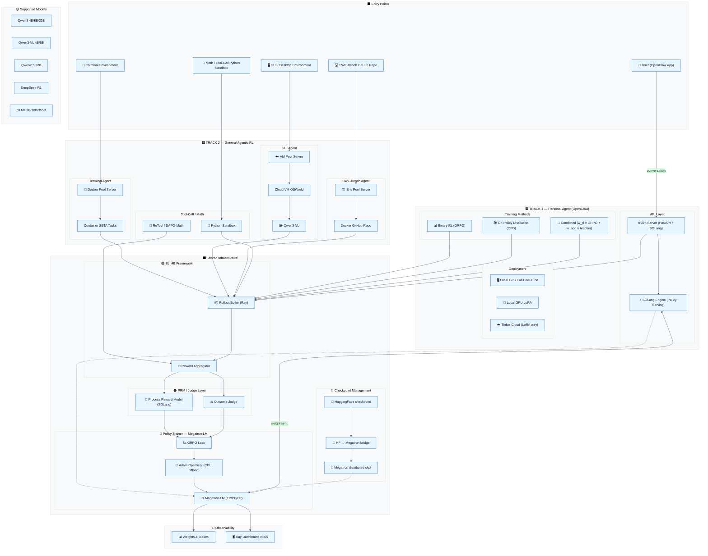

# OpenClaw-RL — System Architecture


---

## Architecture Overview

OpenClaw-RL is a **fully asynchronous reinforcement learning framework** organized around two tracks and a shared infrastructure core.

---

## System Diagram (Mermaid Source)



---

## Component Reference

### Track 1 — Personal Agent

| Component | File | Role |
|-----------|------|------|
| API Server | `openclaw-rl/openclaw_api_server.py` | OpenAI-compatible proxy; intercepts conversations |
| Rollout Worker | `openclaw-rl/openclaw_rollout.py` | Bridges API server to SLIME training buffer |
| OPD Server | `openclaw-opd/openclaw_opd_api_server.py` | Adds hindsight hint extraction + teacher query |
| Combined Server | `openclaw-combine/openclaw_combine_api_server.py` | Unified RL + OPD signal collection |
| Combined Loss | `openclaw-combine/combine_loss.py` | `w_rl × GRPO + w_opd × teacher` advantage |
| Top-K Loss | `openclaw-opd/topk_distillation_loss.py` | Reverse KL over teacher's top-K distribution |
| Cloud Entry | `openclaw-tinker/run.py` | `--method {rl,opd,combine}` for Tinker cloud |

### Track 2 — General Agentic RL

| Domain | Entry Point | Environment |
|--------|-------------|-------------|
| Tool-Call / Math | `toolcall-rl/generate_with_retool.py` | Python sandbox (`tool_sandbox.py`) |
| Terminal | `terminal-rl/generate.py` | Docker containers via `pool_server.py` |
| GUI | `gui-rl/generate_with_gui.py` | Cloud VMs via `env_pool_server.py` |
| SWE-Bench | `swe-rl/generate_with_swe_remote.py` | Docker repos via `swe_env_pool_server.py` |

### Shared Infrastructure

| Component | Technology | Purpose |
|-----------|-----------|---------|
| Rollout Buffer | SLIME + Ray | Async trajectory collection & queuing |
| PRM | SGLang engine | Per-step majority-vote reward (`--prm-m`) |
| Policy Trainer | Megatron-LM | TP/PP/EP distributed GRPO training |
| Inference Engine | SGLang | Fast token generation during rollout |
| Experiment Tracking | Weights & Biases | Loss, reward, eval metrics |
| Cluster Mgmt | Ray 2.54 | Distributed actor system |

---

## Data & Control Flow

```
User / Environment
        │
        ▼
  API Server / Env Pool
  (FastAPI + SGLang)
        │ trajectories
        ▼
  Rollout Buffer (SLIME/Ray)
        │
        ├──▶ PRM (step-wise reward, majority vote)
        │
        └──▶ Outcome Judge (episode reward)
                │
                ▼
          GRPO Advantage Estimator
          A_i = (r_i − mean(r)) / (std(r) + ε)
                │
                ▼
          Megatron-LM Trainer
          PPO clip [0.2, 0.28] + KL reg
                │
                ▼
          Updated Policy Weights
          ──▶ synced back to SGLang engine
```

---

## Parallelism Strategy

| Model Size | Nodes | GPUs/node | TP | PP | EP |
|-----------|-------|-----------|----|----|-----|
| 4B | 1 | 8 | 4 | 1 | 1 |
| 8B | 1 | 8 | 4 | 1 | 1 |
| 32B | 4 | 8 | 8 | 1 | 1 |
| 70B | 8 | 8 | 8 | 2 | 1 |
| MoE (DeepSeek) | 8+ | 8 | 1 | 8 | 32 |

---

*Diagram files:*
- *PNG (high-res, 1.7 MB):* `openclaw-rl-architecture.png`
- *PDF (print quality, 3.0 MB):* `openclaw-rl-architecture.pdf`
- *Mermaid source:* `openclaw-rl-architecture.mmd`
