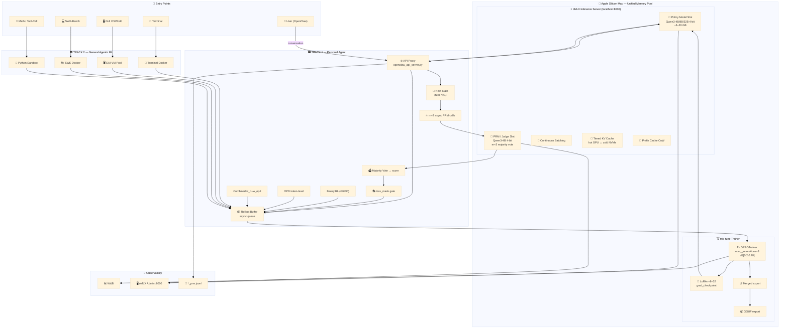

# OpenClaw-RL — System Architecture (MLX / Apple Silicon Stack)


---

## Architecture Overview

OpenClaw-RL on Apple Silicon replaces the CUDA/Linux stack entirely with an MLX-native set of components. Everything runs on a single Mac inside one unified memory pool.

| Original (CUDA/Linux) | MLX Replacement | Notes |
|-----------------------|-----------------|-------|
| Megatron-LM | **mlx-tune** | GRPOTrainer, LoRA, VLM — Unsloth-compatible API |
| SGLang | **oMLX** | Continuous batching, tiered KV cache, OpenAI+Anthropic compatible |
| Ray cluster | Unified memory | Up to 512 GB shared CPU/GPU on Mac Studio Ultra |
| Multi-node TP/PP | Single-process MLX | No NCCL, no distributed setup |

---

## System Diagram (Mermaid Source)



---

## Component Reference

### oMLX — Inference Server

| Feature | Detail |
|---------|--------|
| **Policy model slot** | Serves the current policy; hot-reloads LoRA adapters after each training step |
| **PRM model slot** | Runs PRM judge in a second model slot sharing unified memory |
| **Continuous batching** | Prefill and generation phases run in parallel for high throughput rollout |
| **Tiered KV cache** | Hot tier in GPU memory; inactive KV blocks spill to NVMe SSD |
| **Prefix cache** | Copy-on-Write sharing for repeated system prompt across m PRM calls |
| **API** | OpenAI `/v1/chat/completions` + Anthropic `/v1/messages` |
| **Dashboard** | `http://localhost:8000/admin` — throughput, cache hit rate, memory |

**Start command:**
```bash
omlx serve \
  --model-dir ~/.cache/huggingface/hub \
  --max-model-memory 32GB \
  --max-process-memory 80% \
  --paged-ssd-cache-dir ~/.omlx/cache \
  --hot-cache-max-size 8GB \
  --port 8000 \
  --api-key your-key
```

### mlx-tune — Trainer

| Trainer | Use case | Key args |
|---------|----------|---------|
| `GRPOTrainer` | Binary RL, Combined | `num_generations=8`, `epsilon=0.2`, `beta=0.001` |
| `SFTTrainer` | Cold-start supervised | `max_seq_length`, `packing=True` |
| `VLMSFTTrainer` | GUI agent (Qwen3-VL) | `FastVisionModel.from_pretrained()` |
| `DPOTrainer` | Preference pairs | `beta=0.1` |

**LoRA setup:**
```python
model = FastLanguageModel.get_peft_model(
    model, r=16, lora_alpha=16,
    target_modules=["q_proj","k_proj","v_proj","o_proj",
                    "gate_proj","up_proj","down_proj"],
    use_gradient_checkpointing=True,
)
```

### PRM — Process Reward Model

The PRM is a **prompted language model**, not a fine-tuned classifier. It receives the agent's response at turn N and the next-turn message as evidence, reasons step-by-step, and outputs `\boxed{1}`, `\boxed{-1}`, or `\boxed{0}`.

| Score | Meaning | Effect on training |
|-------|---------|-------------------|
| `+1` | Task progressed | `loss_mask=[1]` — positive GRPO advantage |
| `−1` | Failure / correction | `loss_mask=[1]` — negative GRPO advantage |
| `0` | Ambiguous / neutral | `loss_mask=[0]` — masked out, no gradient |

`m=3` parallel oMLX calls → majority vote → tie resolves to 0.

**At-least-one guarantee:** if a session produces all-zero scores, the last evaluated turn is promoted to `loss_mask=[1]` to ensure every session contributes at least one gradient.

---

## PRM Data Flow (Turn-Level)

```
Agent responds to turn N
         │
         │  response + logprobs → _pending_turn_data
         │
Turn N+1 request arrives  ← next_state evidence
         │
         ├── _fire_prm_scoring()
         │       └── asyncio.gather(
         │               _query_prm_once(0),  ─┐
         │               _query_prm_once(1),   ├─ 3 concurrent oMLX calls
         │               _query_prm_once(2),  ─┘  (wall time = 1× inference)
         │           )
         │       └── majority_vote() → score ∈ {+1, −1, 0}
         │
         └── _submit_turn_sample()
                 loss_mask = [1,...] if score≠0 else [0,...]
                 reward    = {"score": score}
                 → output_queue.put(sample)
                 → GRPOTrainer.train_step()
```

---

## Memory Layout (64 GB Mac Example)

| Region | Size | Contents |
|--------|------|---------|
| oMLX policy slot (Qwen3-8B 4-bit) | ~5 GB | Active model weights |
| oMLX PRM slot (Qwen3-4B 4-bit) | ~3 GB | Judge model weights |
| oMLX KV hot cache | ~8 GB | Active request KV blocks |
| mlx-tune LoRA + gradients | ~10 GB | LoRA adapters, optimizer states |
| OS + Python overhead | ~8 GB | System |
| oMLX NVMe cold tier | → SSD | Spilled KV blocks |
| **Total GPU memory** | **~34 GB** | Fits in 64 GB unified memory |

---

## Deployment Options

| Option | Hardware | Method | Notes |
|--------|----------|--------|-------|
| **Local LoRA** | 16 GB+ Mac | LoRA r=8–16 | Simplest, works on M1 any |
| **Local full FT** | 64 GB+ Mac | All weights | Mac Ultra/Max required |
| **Tinker Cloud** | No local GPU | LoRA only | `python run.py --method combine` |
| **Hybrid** | Mac + cloud | oMLX local rollout → Unsloth train | mlx-tune API = Unsloth API |

---

## Supported Models (mlx-community 4-bit)

| Model | Task | RAM |
|-------|------|-----|
| Qwen3 4B | Policy, PRM | 16 GB |
| Qwen3 8B | Policy, PRM | 24 GB |
| Qwen3 32B | Policy | 64 GB |
| Qwen3-VL 8B | GUI agent | 24 GB |
| Qwen2.5 32B | Tool-call | 64 GB |
| DeepSeek-R1 Distill | Math RL | 24–64 GB |

---

*Diagram files:*
- *PNG (high-res 5000×6400 @ 3×, 2.1 MB):* `openclaw-rl-mlx-architecture.png`
- *PDF (print quality, 3.9 MB):* `openclaw-rl-mlx-architecture.pdf`
- *Mermaid source:* `openclaw-rl-mlx-architecture.mmd`
