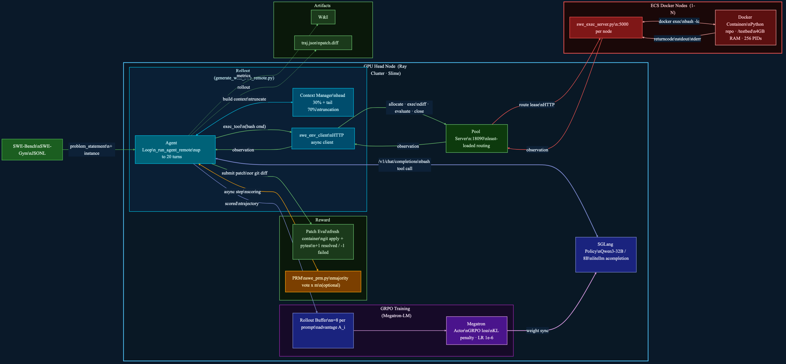

# SWE-RL — System Architecture

> RL training for a software engineering agent. The model learns to solve real GitHub issues by executing bash commands inside isolated Docker containers, trained with GRPO (+ optional PRM step rewards).



---

## System Overview

| Tier | Machines | Role |
|------|----------|------|
| **GPU Head Node** | 1–8 GPU nodes (Ray Cluster) | Slime training, SGLang policy inference, Pool Server, optional PRM |
| **ECS Docker Nodes** | 1–N CPU nodes | Exec servers managing isolated Docker containers per episode |

**Scale:** up to 8 nodes · 64 GPUs · 128 concurrent Docker containers

---

## Component Map

### Dataset
- **Sources:** SWE-Bench (`swebench/SWE-bench_Verified`) or SWE-Gym
- **Format:** JSONL — `problem_statement` + `instance` metadata (repo, eval script, Docker image)
- **Prep:** [data/preprocess_swe_dataset.py](../swe-rl/data/preprocess_swe_dataset.py)

---

### generate_with_swe_remote.py — Slime Entry Point
The central orchestrator. Implements two functions called by the Slime trainer:

**`generate(args, sample, sampling_params)`**
- Wraps `_generate_impl()` with a timeout guard (`SWE_ROLLOUT_TIMEOUT`, default 1800 s)
- Sets `sample.status = ABORTED` on timeout

**`_generate_impl(args, sample, sampling_params)`** — five-step pipeline:
1. Allocate a Docker container via Pool Server (`env_client.allocate(image)`)
2. Run `_run_agent_remote()` — multi-turn bash loop
3. Extract final patch (submit command or `git diff` fallback)
4. Allocate a fresh eval container → apply patch → run test suite → get `resolved` flag
5. Encode tokens + loss mask → return `Sample` or `list[Sample]` (dynamic history mode)

**`reward_func(args, sample)`**
- **Default:** `score = outcome_reward` (+1 resolved / −1 failed)
- **With PRM:** `score = outcome_reward + prm_step_coef × mean(prm_step_scores)`

---

### Agent Loop (`_run_agent_remote`)
Multi-turn bash loop — up to `step_limit=20` iterations per episode:

```
Turn N:
  1. swe_context_manager  →  truncate messages to fit context window
  2. litellm.acompletion  →  SGLang Policy generates response
  3. _parse_bash_action()  →  extract ```bash block from response
  4. env_client.exec()    →  send bash command to Pool Server → Docker
  5. _render_observation()→  format returncode + stdout/stderr
  6. (optional) prm_agent.submit_step_judge()  →  async PRM scoring
  7. Append observation to messages → Turn N+1
Exit:  submit command detected | max steps | token budget
```

---

### swe_context_manager.py — Context Window Management
Prevents overflow on long rollouts via **head + tail truncation**:
- Budget: `rollout_max_context_len` − `max_new_tokens` (e.g. 16384 − 4096 = 12288)
- **Head (30%):** keeps early exploration turns (~3450 tokens)
- **Tail (70%):** keeps recent context (~8050 tokens)
- Inserts `[... N turn(s) omitted ...]` marker between segments

---

### SGLang Policy Server
- Serves the policy model (Qwen3-32B or 8B) via SGLang
- Called through `litellm.acompletion()` — standard OpenAI-compat interface
- Tensor parallel across `ACTOR_GPUS`
- Weight sync from Megatron after each GRPO update

---

### Pool Server ([server/swe_env_pool_server.py](../swe-rl/server/swe_env_pool_server.py) — port 18090)
Runs on the **GPU head node**. Load-balances Docker container requests across ECS nodes:

| Endpoint | Purpose |
|----------|---------|
| `POST /allocate` | Pick least-loaded healthy node, create container → return `lease_id` |
| `POST /exec` | Route bash command to correct node |
| `POST /diff` | Retrieve `git diff` from container |
| `POST /evaluate` | Apply patch + run eval script → `resolved` |
| `POST /heartbeat` | Keep lease alive |
| `POST /close` | Destroy container, release capacity |
| `GET /status` | Node health + active container counts |

**Routing:** picks node with fewest active containers; marks node unhealthy on repeated failures.

---

### Exec Server ([server/swe_exec_server.py](../swe-rl/server/swe_exec_server.py) — port 5000)
Runs on **each ECS Docker node**. Wraps `docker` CLI:

| Endpoint | Docker command |
|----------|---------------|
| `POST /container/create` | `docker run -d --pids-limit 256 --memory 4g <image> sleep infinity` |
| `POST /container/exec` | `docker exec -w /testbed <cid> bash -lc <cmd>` |
| `POST /container/diff` | `docker exec <cid> bash -lc "git add -A && git diff --cached"` |
| `POST /container/evaluate` | `git apply <patch>` → run `eval_script` inside container |
| `POST /container/destroy` | `docker rm -f <cid>` |

Container limits: **256 PIDs**, **4 GB RAM**, named `swe-{uuid[:12]}`.

---

### Patch Evaluation (fresh container)
After the agent loop completes:
1. Allocate a **fresh** Docker container (same image, clean repo)
2. Apply patch: `git apply <patch>`
3. Run the instance-specific `eval_script` (typically pytest)
4. Return `resolved` (bool) → outcome reward: **+1** resolved / **−1** failed

---

### swe_prm.py — Process Reward Model (optional)
`SweRewardAgent` scores each bash step asynchronously during the agent loop:

- **Judge prompt:** last `max_history_steps=8` turns + current step + execution result
- **M-voting:** `prm_m=3` independent LLM calls per step; majority determines sign
- **Score extraction:** regex for `\boxed{...}` in PRM response → **+1** (good) / **−1** (bad)
- **Async dispatch:** `submit_step_judge()` returns an `asyncio.Task` (non-blocking)
- **Collection:** `collect_step_results()` awaits all tasks at episode end
- **Reward blend:** `outcome_reward + prm_step_coef × mean(step_scores)`

Enable via `--prm-enable` + `--prm-model-path` in training script.

---

### message_utils.py — Token Encoding + Loss Mask
Converts multi-turn conversation to training tensors:

1. Detect generation prompt IDs (e.g. `<|im_start|>assistant\n`)
2. User turns → `loss_mask = 0` (no gradient)
3. Assistant turns → `loss_mask = 1` on generated tokens only
4. **Dynamic history mode:** one `Sample` per rollout step, each aligned to the context the model actually saw (via context manager output)

---

### Rollout Buffer + GRPO
- Accumulates `n_samples_per_prompt=8` scored trajectories per task
- Computes advantage:
  ```
  A_i = (r_i − mean(r)) / (std(r) + ε)
  ```
- Passes scored batch to Megatron-LM GRPO trainer

---

### Megatron-LM GRPO Trainer
- GRPO loss with KL penalty (`kl_loss_coef=0.01`)
- Optimizer: Adam, LR `1e-6`
- Tensor parallel across training GPUs
- After each update: syncs weights to SGLang Policy server

---

## Data Flow — One Episode

```
1.  Slime DataLoader → sample: problem_statement + instance metadata
2.  generate() dispatched to RolloutManager (Ray Actor)
3.  Pool Server allocates Docker container on least-loaded ECS node
4.  Agent loop (up to 20 turns):
      a. swe_context_manager truncates history if needed
      b. SGLang Policy generates response (via litellm)
      c. bash command extracted from response
      d. env_client.exec() → Pool Server → Exec Server → docker exec
      e. stdout/stderr returned as observation
      f. (optional) PRM scores this step async
      g. observation appended → next turn
5.  Agent submits patch (or git diff fallback)
6.  Fresh container: git apply + pytest → resolved (+1/-1)
7.  message_utils encodes tokens + loss mask
8.  Dynamic history → list[Sample] (one per step) OR single Sample
9.  reward_func: outcome_reward [+ prm_step_coef × mean(step_scores)]
10. Rollout Buffer accumulates 8 trajectories per task
11. GRPO advantage computed → Megatron training step
12. Updated weights synced to SGLang Policy
```

---

## GPU Allocation (8-node example)

| Role | GPUs | Config |
|------|------|--------|
| SGLang Policy | dedicated GPU group | TP per node |
| Megatron GRPO Trainer | remaining GPUs | TP+PP across nodes |
| SGLang PRM (optional) | separate node/GPUs | TP for judge model |

---

## Key Configuration Knobs

| Variable | Default | Effect |
|----------|---------|--------|
| `SWE_MAX_CONCURRENT` | 8 (128 in scripts) | Max parallel Docker containers |
| `SWE_MAX_CONTAINERS_PER_NODE` | 15 | Per-ECS-node cap |
| `SWE_ROLLOUT_TIMEOUT` | 1800 s | Total timeout per episode |
| `rollout_max_context_len` | 16384 | Context window (triggers CM) |
| `rollout_max_response_len` | 4096 | Max tokens per LLM generation |
| `n_samples_per_prompt` | 8 | GRPO group size |
| `step_limit` | 20 | Max bash turns per episode |
| `kl_loss_coef` | 0.01 | KL penalty vs base model |
| `prm_enable` | false | Enable PRM step scoring |
| `prm_m` | 3 | PRM majority vote count |
| `prm_step_coef` | 1.0 | Weight of step reward |
| `dynamic_history` | true | One sample per rollout step |

---

## Files Reference

| File | Role |
|------|------|
| [generate_with_swe_remote.py](../swe-rl/generate_with_swe_remote.py) | Slime generate + reward_func entry point |
| [swe_env_client.py](../swe-rl/swe_env_client.py) | Async HTTP client for Pool Server |
| [swe_context_manager.py](../swe-rl/swe_context_manager.py) | Head+tail context window truncation |
| [swe_prm.py](../swe-rl/swe_prm.py) | PRM step-wise reward agent |
| [message_utils.py](../swe-rl/message_utils.py) | Token encoding + loss mask generation |
| [swe_utils.py](../swe-rl/swe_utils.py) | Docker image name resolver |
| [server/swe_env_pool_server.py](../swe-rl/server/swe_env_pool_server.py) | Pool server — lease mgmt + node routing |
| [server/swe_exec_server.py](../swe-rl/server/swe_exec_server.py) | Exec server — docker CLI wrapper per node |
| [server/setup_ecs_seed.sh](../swe-rl/server/setup_ecs_seed.sh) | One-time ECS node initialization |
| [scripts/run_swe_rl_32b_remote_8nodes.sh](../swe-rl/scripts/run_swe_rl_32b_remote_8nodes.sh) | 8-node 32B training launcher |
| [scripts/run_swe_rl_8b_prm_5nodes_remote.sh](../swe-rl/scripts/run_swe_rl_8b_prm_5nodes_remote.sh) | 5-node 8B training with PRM |
| [scripts/run_swe_rl.sh](../swe-rl/scripts/run_swe_rl.sh) | Single-node training launcher |
| [eval/eval_swe.py](../swe-rl/eval/eval_swe.py) | Standalone evaluation (no training) |
| [data/preprocess_swe_dataset.py](../swe-rl/data/preprocess_swe_dataset.py) | HuggingFace → JSONL converter |
| [swebench.yaml](../swe-rl/swebench.yaml) | Agent prompt templates + config |
