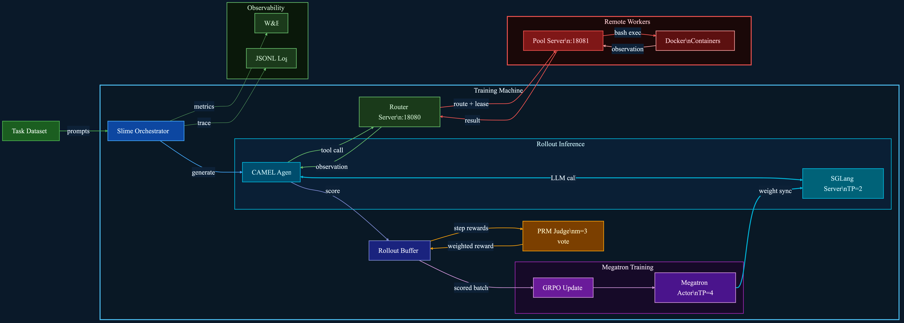

# Terminal-RL — System Architecture

> RL training for a terminal/shell agent. The model learns to execute bash commands inside Docker containers to complete tasks, trained with GRPO (+ optional PRM step rewards).



---

## System Overview

The system splits across two independent tiers:

| Tier | Machines | Role |
|------|----------|------|
| **Training Machine** | 1 GPU node (8× GPU) | Slime orchestration, SGLang inference, Megatron training, Router |
| **Remote Workers** | 1–N CPU/Docker hosts | Pool servers managing Docker container environments |

---

## Component Map

### Task Dataset
- **Source:** `seta_env` — from [camel-ai/seta-env](https://github.com/camel-ai/seta-env/tree/main/Dataset)
- **Format:** JSONL, each line has a `task` field (terminal instruction) and `score` field
- **Prep:** [data_utils/download.py](../terminal-rl/data_utils/download.py) → [data_utils/convert_task_to_dataset.py](../terminal-rl/data_utils/convert_task_to_dataset.py)

---

### Slime Orchestrator (`train_async.py`)
- Entry point for the training loop
- Reads prompts from dataset, dispatches rollouts, collects scored batches
- Calls [`generate.generate`](../terminal-rl/generate.py) as the custom rollout function
- Calls [`rollout_log.rollout_log`](../terminal-rl/rollout_log.py) to persist trajectory traces
- Submits GRPO gradient updates to Megatron after each rollout batch
- Logs metrics to W&B (`project: slime`, `group: qwen3-8B-rl_terminal`)

---

### CAMEL Agent ([agent/camel_agent.py](../terminal-rl/agent/camel_agent.py))
- Wraps CAMEL's `ChatAgent` with a custom `CamelAgentBackend` that calls SGLang
- Runs a **multi-turn tool-call loop**:
  1. Gets context from memory
  2. Calls `SGLangTurnClient.generate_turn` for the next model response
  3. Parses tool calls (handles JSON parse errors up to `max_parse_errors=3`)
  4. Sends `exec_tool` requests to the Router Server
  5. Receives observations and adds them to memory
  6. Repeats until task complete or token budget exhausted
- System prompt: [`get_developer_agent_prompt`](../terminal-rl/agent/prompts.py) — Linux/Docker developer context

---

### SGLang Server (Rollout Inference)
- Serves Qwen3-8B policy model
- **GPU split:** `ROLLOUT_GPUS=4`, `TP=2` per engine (2 parallel engines)
- Context length: 16384 tokens
- `--sglang-mem-fraction-static 0.6` — 60% GPU memory for KV cache
- Weight sync from Megatron after each training step

---

### Router Server ([router_server.py](../terminal-rl/router_server.py) — port 18080)
- FastAPI server running on the **training machine**
- Sits between CAMEL Agent and remote worker pool servers
- **Endpoints:**

| Endpoint | Purpose |
|----------|---------|
| `POST /allocate` | Reserve a Docker container for a task (returns `lease_id`) |
| `POST /reset` | Initialize container with task spec and return tool schemas |
| `POST /exec_tool` | Execute a bash command, return observation |
| `POST /heartbeat` | Keep lease alive |
| `POST /evaluate` | Score the completed episode |
| `POST /close` | Release the container |
| `GET /healthz` | Health check |
| `GET /status` | Worker pool status |

- **Routing strategy:** SHA1 hash of `task_key` → consistent hash to primary worker, failover to next candidate on error
- **Lease encoding:** `"{worker_idx}:{worker_lease_id}"` — encodes which worker holds the container

---

### Pool Server ([remote/pool_server.py](../terminal-rl/remote/pool_server.py) — port 18081)
- FastAPI server running on **each remote worker machine**
- Manages a `WorkerPool` of `RunSlot` objects, each wrapping a `TerminalEnv` (Docker container)
- **Capacity:** `max_tasks=16`, `max_runs_per_task=8` per worker
- **Idle reaper:** background task cleans up slots idle > 600s
- **Idempotency cache:** 300s TTL prevents duplicate container allocation on retry

Container lifecycle per episode:
```
/allocate → lease_id
/reset    → user_msg + tool_schemas (pulls Docker image, starts container)
/exec_tool (× N turns) → bash output
/evaluate → float score (0.0–1.0)
/close    → releases container
```

---

### Docker Containers ([remote/terminal_env.py](../terminal-rl/remote/terminal_env.py))
- Each `TerminalEnv` manages one Docker container per episode
- Container runs the task environment from `seta_env` task spec
- `exec_tool` maps to bash command execution inside the container
- `evaluate` runs the task-specific grader script inside the container
- Containers are isolated per episode — reset on each `rollout`

---

### Rollout Buffer
- Collects complete episode trajectories with final scores
- Feeds into GRPO advantage estimation:
  ```
  A_i = (r_i − mean(r)) / (std(r) + ε)
  ```
  over `n_samples_per_prompt=8` rollouts per task
- `--dynamic_history` flag: GRPO uses full conversation history for advantage, not just final turn

---

### PRM Judge (optional)
- Enabled via `PRM_ENABLE=1` in [`terminal_qwen3_8b_prm_rl_2nodes.sh`](../terminal-rl/terminal_qwen3_8b_prm_rl_2nodes.sh)
- Runs as a separate SGLang engine on dedicated GPUs
- Scores **intermediate steps** (each bash turn), not just the final episode
- `PRM_M=3` — 3 independent evaluations per step, majority vote
- `PRM_STEP_COEF=1.0` — weight of step reward added to final reward
- Can use an external PRM endpoint via `PRM_SGLANG_URL`

---

### Megatron Actor (Training)
- **GPU split:** `ACTOR_GPUS=4`, `TP=4` (each layer sharded across 4 GPUs)
- Full activation recomputation (`recompute-granularity full`)
- `max-tokens-per-gpu=16384`, `log-probs-chunk-size=1024`
- GRPO loss with KL penalty: `--kl-loss-coef 0.01`, `--kl-loss-type k3`
  - Note: KL is enabled here (unlike the OpenClaw combine scripts where it's 0)
- Optimizer: Adam, LR=`1e-6`, CPU offload + D2H/H2D overlap

---

## Data Flow — One Episode

```
1.  Slime picks task from dataset
2.  CAMEL Agent starts multi-turn loop
3.  Turn N:
      a. Agent builds context (system + history)
      b. SGLang generates response (bash command as tool call)
      c. Agent sends exec_tool → Router → Pool Server → Docker
      d. Docker runs bash command → stdout/stderr returned as observation
      e. Agent appends observation to memory, starts Turn N+1
4.  Episode ends (task complete / token budget / max turns)
5.  /evaluate → Docker runs grader → score (0.0–1.0) returned
6.  Full trajectory added to Rollout Buffer with score
7.  After 8 trajectories for the same task:
      a. PRM scores each turn (optional)
      b. GRPO computes advantage across 8 rollouts
      c. Megatron runs gradient update
      d. Updated weights synced to SGLang
```

---

## GPU Allocation (8× GPU Node)

| Role | GPUs | Config |
|------|------|--------|
| Megatron Actor | 4 | TP=4, full activation recompute |
| SGLang Rollout | 4 | TP=2 per engine (2 engines) |
| PRM (optional) | +N | Separate node in 2-node script |

---

## Key Configuration Knobs

| Variable | Default | Effect |
|----------|---------|--------|
| `NUM_GPUS` | 8 | Total GPUs on training machine |
| `ACTOR_GPUS` | 4 | GPUs for Megatron training |
| `ROLLOUT_GPUS` | 4 | GPUs for SGLang inference |
| `WORKER_URLS` | — | Comma-separated pool server URLs |
| `PRM_ENABLE` | 0 | Enable PRM step scoring |
| `PRM_M` | 3 | Evaluations per step for majority vote |
| `n_samples_per_prompt` | 8 | GRPO group size |
| `rollout_batch_size` | 16 | Tasks per rollout round |
| `kl_loss_coef` | 0.01 | KL penalty vs base model |

---

## Files Reference

| File | Role |
|------|------|
| [terminal_qwen3_8b_rl.sh](../terminal-rl/terminal_qwen3_8b_rl.sh) | Main training launcher (single node) |
| [terminal_qwen3_8b_prm_rl_2nodes.sh](../terminal-rl/terminal_qwen3_8b_prm_rl_2nodes.sh) | 2-node variant with PRM enabled |
| [router_server.py](../terminal-rl/router_server.py) | Environment routing layer (B-layer) |
| [remote/pool_server.py](../terminal-rl/remote/pool_server.py) | Docker container pool manager (C-layer) |
| [remote/terminal_env.py](../terminal-rl/remote/terminal_env.py) | Single Docker container wrapper |
| [agent/camel_agent.py](../terminal-rl/agent/camel_agent.py) | CAMEL-based multi-turn agent loop |
| [agent/prm_agent.py](../terminal-rl/agent/prm_agent.py) | PRM-aware agent variant |
| [agent/prompts.py](../terminal-rl/agent/prompts.py) | System prompt: Linux developer persona |
| [generate.py](../terminal-rl/generate.py) | Custom Slime rollout function |
| [rollout_log.py](../terminal-rl/rollout_log.py) | JSONL trajectory logger |
| [inference_client.py](../terminal-rl/inference_client.py) | SGLang turn client wrapper |
| [env_client.py](../terminal-rl/env_client.py) | HTTP client for Router/Pool API |
| [data_utils/download.py](../terminal-rl/data_utils/download.py) | Dataset downloader (seta_env) |
| [data_utils/convert_task_to_dataset.py](../terminal-rl/data_utils/convert_task_to_dataset.py) | Task → JSONL converter |
