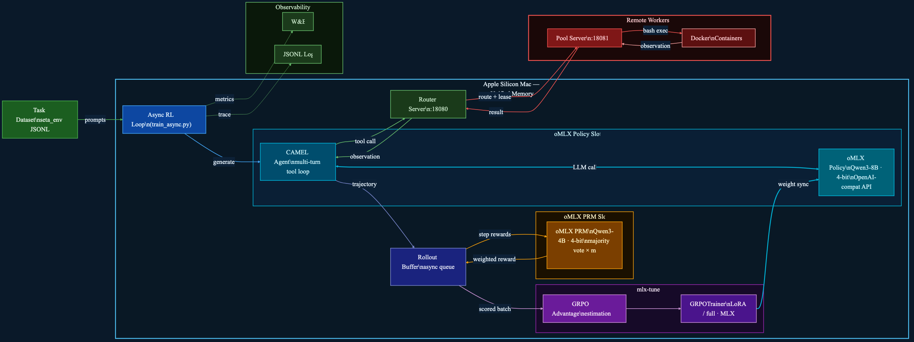

# Terminal-RL — oMLX System Architecture

> RL training for a terminal/shell agent on **Apple Silicon** (MLX-native stack).
> The model learns to execute bash commands inside Docker containers to complete tasks, trained with GRPO (+ optional PRM step rewards).
>
> **Replaces:** Slime → Ray → SGLang → Megatron-LM
> **With:** Async RL Loop | oMLX Policy Slot | oMLX PRM Slot | mlx-tune



---

## Stack Migration

| Original (CUDA/Linux) | Replacement (MLX/macOS) | Purpose |
|-----------------------|-------------------------|---------|
| Slime Orchestrator (Ray) | **Async RL Loop** (Python asyncio) | Training orchestration |
| SGLang Server | **oMLX Policy Slot** | Policy model inference |
| PRM SGLang Engine | **oMLX PRM Slot** | Step reward scoring |
| Megatron-LM Actor | **mlx-tune GRPOTrainer** | Gradient updates |
| Ray cluster | Unified Memory | Multi-process coordination |

---

## System Overview

The redesigned system runs entirely on a **single Apple Silicon Mac** using unified memory:

| Tier | Machine | Role |
|------|---------|------|
| **Mac (Unified Memory)** | 1 Apple Silicon Mac (64–512 GB) | Async RL loop, oMLX inference (policy + PRM), mlx-tune training |
| **Remote Workers** | 1–N CPU/Docker hosts | Pool servers managing Docker container environments |

---

## Component Map

### Task Dataset
- **Source:** `seta_env` — from [camel-ai/seta-env](https://github.com/camel-ai/seta-env/tree/main/Dataset)
- **Format:** JSONL, each line has a `task` field (terminal instruction) and `score` field
- **Prep:** [data_utils/download.py](../terminal-rl/data_utils/download.py) → [data_utils/convert_task_to_dataset.py](../terminal-rl/data_utils/convert_task_to_dataset.py)

---

### Async RL Loop (`train_async.py`)
- Replaces the Slime + Ray orchestrator
- Reads prompts from dataset, dispatches rollouts to CAMEL Agent, collects scored batches
- Calls [`generate.generate`](../terminal-rl/generate.py) as the custom rollout function
- Calls [`rollout_log.rollout_log`](../terminal-rl/rollout_log.py) to persist trajectory traces
- Submits GRPO gradient updates to mlx-tune after each rollout batch
- Logs metrics to W&B

---

### oMLX Policy Slot (Rollout Inference)
- **Replaces:** SGLang Server
- Serves the policy model (e.g. Qwen3-8B at 4-bit ≈ 5 GB) via OpenAI-compatible API
- Runs natively on Apple Silicon using the MLX compute graph
- **Features:** continuous batching, tiered KV cache (hot RAM → cold NVMe SSD), speculative decoding
- Context length configurable (default 16384 tokens)
- Weight sync from mlx-tune after each training step (in-place MLX array update)

---

### CAMEL Agent ([agent/camel_agent.py](../terminal-rl/agent/camel_agent.py))
- Wraps CAMEL's `ChatAgent` with a custom backend that calls the **oMLX Policy Slot**
- Runs a **multi-turn tool-call loop**:
  1. Gets context from memory
  2. Calls `oMLX` `/v1/chat/completions` for the next model response
  3. Parses tool calls (self-correcting JSON parser, up to `max_parse_errors=3`)
  4. Sends `exec_tool` requests to the Router Server
  5. Receives observations and adds them to memory
  6. Repeats until task complete or token budget exhausted
- System prompt: [`get_developer_agent_prompt`](../terminal-rl/agent/prompts.py) — Linux/Docker developer context

---

### Router Server ([router_server.py](../terminal-rl/router_server.py) — port 18080)
- FastAPI server running on the **training machine**
- Sits between CAMEL Agent and remote worker pool servers
- **Endpoints:**

| Endpoint | Purpose |
|----------|---------|
| `POST /allocate` | Reserve a Docker container for a task (returns `lease_id`) |
| `POST /reset` | Initialize container with task spec and return tool schemas |
| `POST /exec_tool` | Execute a bash command, return observation |
| `POST /heartbeat` | Keep lease alive |
| `POST /evaluate` | Score the completed episode |
| `POST /close` | Release the container |
| `GET /healthz` | Health check |
| `GET /status` | Worker pool status |

- **Routing strategy:** SHA1 hash of `task_key` → consistent hash to primary worker, failover on error
- **Lease encoding:** `"{worker_idx}:{worker_lease_id}"` — encodes which worker holds the container

---

### Pool Server ([remote/pool_server.py](../terminal-rl/remote/pool_server.py) — port 18081)
- FastAPI server running on **each remote worker machine**
- Manages a `WorkerPool` of `RunSlot` objects, each wrapping a `TerminalEnv` (Docker container)
- **Capacity:** `max_tasks=16`, `max_runs_per_task=8` per worker
- **Idle reaper:** background task cleans up slots idle > 600s
- **Idempotency cache:** 300s TTL prevents duplicate container allocation on retry

Container lifecycle per episode:
```
/allocate → lease_id
/reset    → user_msg + tool_schemas (pulls Docker image, starts container)
/exec_tool (× N turns) → bash output
/evaluate → float score (0.0–1.0)
/close    → releases container
```

---

### Docker Containers ([remote/terminal_env.py](../terminal-rl/remote/terminal_env.py))
- Each `TerminalEnv` manages one Docker container per episode
- Container runs the task environment from `seta_env` task spec
- `exec_tool` maps to bash command execution inside the container
- `evaluate` runs the task-specific grader script inside the container
- Containers are isolated per episode — reset on each `rollout`

---

### Rollout Buffer
- Python `asyncio.Queue` — replaces Ray's distributed object store
- Collects complete episode trajectories with final scores
- Feeds into GRPO advantage estimation:
  ```
  A_i = (r_i − mean(r)) / (std(r) + ε)
  ```
  over `n_samples_per_prompt=8` rollouts per task
- `--dynamic_history` flag: GRPO uses full conversation history for advantage

---

### oMLX PRM Slot (optional)
- **Replaces:** PRM SGLang Engine
- Runs a separate **Judge / PRM model** (e.g. Qwen3-4B at 4-bit ≈ 3 GB) in a second oMLX model slot
- Both policy and PRM slots live in unified memory — no cross-machine coordination
- Scores **intermediate steps** (each bash turn), not just the final episode
- `PRM_M=3` — 3 independent evaluations per step, majority vote
- `PRM_STEP_COEF=1.0` — weight of step reward added to final reward
- Can also call an external PRM endpoint via `PRM_OMLX_URL`

---

### mlx-tune GRPOTrainer (Training)
- **Replaces:** Megatron-LM Actor
- Runs GRPO gradient updates natively via the MLX compute graph
- Supports **LoRA** (low-rank adapters, ≈ 8–16 GB) or **full fine-tuning**
- No tensor parallelism needed — unified memory handles all sharding
- KL penalty: `kl_loss_coef=0.01`, `kl_loss_type=k3`
- Optimizer: AdamW, LR=`1e-6`
- Weight sync back to oMLX Policy Slot via in-place MLX array update (no serialization)

---

## Data Flow — One Episode

```
1.  Async RL Loop picks task from dataset
2.  CAMEL Agent starts multi-turn loop
3.  Turn N:
      a. Agent builds context (system + history)
      b. oMLX Policy Slot generates response (bash command as tool call)
      c. Agent sends exec_tool → Router → Pool Server → Docker
      d. Docker runs bash command → stdout/stderr returned as observation
      e. Agent appends observation to memory, starts Turn N+1
4.  Episode ends (task complete / token budget / max turns)
5.  /evaluate → Docker runs grader → score (0.0–1.0) returned
6.  Full trajectory added to Rollout Buffer with score
7.  After 8 trajectories for the same task:
      a. oMLX PRM Slot scores each turn (optional)
      b. GRPO computes advantage across 8 rollouts
      c. mlx-tune runs gradient update (LoRA or full)
      d. Updated weights synced to oMLX Policy Slot (in-place)
```

---

## Memory Layout (Apple Silicon)

```
┌────────────────────────────────────────────────────────┐
│               Unified Memory (e.g. 64 GB)              │
│                                                        │
│  ┌──────────────────┐  ┌──────────────────┐           │
│  │  oMLX Policy     │  │  oMLX PRM Slot   │           │
│  │  Qwen3-8B · 4bit │  │  Qwen3-4B · 4bit │           │
│  │  hot tier ≈ 5 GB │  │  hot tier ≈ 3 GB │           │
│  └──────────────────┘  └──────────────────┘           │
│                                                        │
│  ┌──────────────────────────────────────────────┐     │
│  │  mlx-tune (LoRA adapters + gradients)        │     │
│  │  ≈ 8–16 GB depending on batch size           │     │
│  └──────────────────────────────────────────────┘     │
│                                                        │
│  ┌──────────────────────────────────────────────┐     │
│  │  oMLX SSD KV cache (cold tier → NVMe)        │     │
│  │  spills inactive KV blocks to disk           │     │
│  └──────────────────────────────────────────────┘     │
└────────────────────────────────────────────────────────┘
```

---

## Key Configuration Knobs

| Variable | Default | Effect |
|----------|---------|--------|
| `POLICY_MODEL` | `Qwen3-8B-4bit` | Policy model loaded into oMLX Policy Slot |
| `PRM_MODEL` | `Qwen3-4B-4bit` | Judge model loaded into oMLX PRM Slot |
| `CONTEXT_LEN` | 16384 | Max context tokens per rollout turn |
| `WORKER_URLS` | — | Comma-separated pool server URLs |
| `PRM_ENABLE` | 0 | Enable oMLX PRM step scoring |
| `PRM_M` | 3 | Evaluations per step for majority vote |
| `PRM_STEP_COEF` | 1.0 | Weight of step reward vs final reward |
| `n_samples_per_prompt` | 8 | GRPO group size |
| `rollout_batch_size` | 16 | Tasks per rollout round |
| `kl_loss_coef` | 0.01 | KL penalty vs base model |
| `lora_rank` | 16 | LoRA rank (0 = full fine-tune) |

---

## Files Reference

| File | Role |
|------|------|
| [terminal_qwen3_8b_rl.sh](../terminal-rl/terminal_qwen3_8b_rl.sh) | Main training launcher (single node) |
| [terminal_qwen3_8b_prm_rl_2nodes.sh](../terminal-rl/terminal_qwen3_8b_prm_rl_2nodes.sh) | 2-node variant with PRM enabled |
| [router_server.py](../terminal-rl/router_server.py) | Environment routing layer |
| [remote/pool_server.py](../terminal-rl/remote/pool_server.py) | Docker container pool manager |
| [remote/terminal_env.py](../terminal-rl/remote/terminal_env.py) | Single Docker container wrapper |
| [agent/camel_agent.py](../terminal-rl/agent/camel_agent.py) | CAMEL-based multi-turn agent loop |
| [agent/prm_agent.py](../terminal-rl/agent/prm_agent.py) | PRM-aware agent variant |
| [agent/prompts.py](../terminal-rl/agent/prompts.py) | System prompt: Linux developer persona |
| [generate.py](../terminal-rl/generate.py) | Custom rollout function |
| [rollout_log.py](../terminal-rl/rollout_log.py) | JSONL trajectory logger |
| [inference_client.py](../terminal-rl/inference_client.py) | oMLX turn client wrapper |
| [env_client.py](../terminal-rl/env_client.py) | HTTP client for Router/Pool API |
| [data_utils/download.py](../terminal-rl/data_utils/download.py) | Dataset downloader (seta_env) |
| [data_utils/convert_task_to_dataset.py](../terminal-rl/data_utils/convert_task_to_dataset.py) | Task → JSONL converter |
