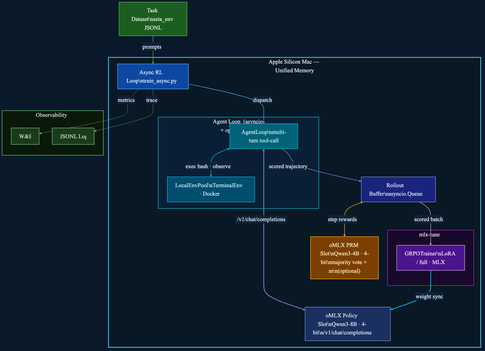

# Terminal-RL — Simplified oMLX Architecture

> RL training for a terminal/shell agent, fully on **Apple Silicon** (MLX-native, no CUDA, no Ray, no remote workers, no CAMEL).



---

## Design Principles

- **Single Mac** — everything runs in unified memory; no cross-machine coordination
- **No CAMEL** — plain `asyncio` + `openai` client replaces the CAMEL framework
- **No Router/Pool Server** — `LocalEnvPool` manages Docker containers directly in-process
- **No Ray** — Python `asyncio.Queue` replaces the distributed object store
- **oMLX OpenAI-compat API** — any standard client works; no SGLang-specific adapter needed

---

## Component Map

### Task Dataset
- **Source:** `seta_env` JSONL — `task` field (terminal instruction) + `score` field
- **Prep:** `data_utils/download.py` → `data_utils/convert_task_to_dataset.py`

---

### Async RL Loop (`train_async.py`)
- Top-level training loop
- Reads tasks from dataset, dispatches to `AgentLoop`, collects scored trajectories
- Submits GRPO batches to mlx-tune after every `rollout_batch_size` episodes
- Logs metrics to W&B, writes JSONL trajectory traces

---

### AgentLoop (`agent_loop.py`)
- Plain `asyncio` coroutine — no framework dependency
- **Multi-turn tool-call loop:**
  1. Build `messages` list (system prompt + history)
  2. `POST /v1/chat/completions` → oMLX Policy Slot
  3. Parse tool call from response (inline JSON parser, retry up to 3×)
  4. Call `LocalEnvPool.exec(lease_id, bash_cmd)` → stdout/stderr
  5. Append observation to `messages`, go to step 1
  6. Exit on task-complete signal, token budget, or max turns
- Calls `LocalEnvPool.evaluate(lease_id)` for final score
- Returns complete trajectory (messages + score) to Async RL Loop

```python
# ~50 lines, no framework needed
async def run_episode(task, policy_url, env_pool):
    lease = await env_pool.allocate(task)
    messages = [{"role": "system", "content": SYSTEM_PROMPT},
                {"role": "user",   "content": task.prompt}]
    for _ in range(MAX_TURNS):
        resp = await openai_client.chat.completions.create(
            model="policy", messages=messages)
        tool_call = parse_tool_call(resp)
        obs = await env_pool.exec(lease, tool_call.bash_cmd)
        messages += [resp.message, {"role": "tool", "content": obs}]
        if done(obs): break
    score = await env_pool.evaluate(lease)
    await env_pool.close(lease)
    return Trajectory(messages=messages, score=score)
```

---

### oMLX Policy Slot
- Serves policy model (e.g. Qwen3-8B 4-bit ≈ 5 GB) via `/v1/chat/completions`
- OpenAI-compatible — `AgentLoop` uses the standard `openai` Python client
- Continuous batching, tiered KV cache (hot RAM → cold NVMe)
- Weight sync from mlx-tune via in-place MLX array update (no serialization)

---

### LocalEnvPool (`local_env_pool.py`)
- Replaces Router Server + Pool Server + remote worker tier
- Manages a pool of `TerminalEnv` Docker containers **on the same Mac**
- API mirrors the old Pool Server but is called in-process (no HTTP hop):

| Method | Purpose |
|--------|---------|
| `allocate(task)` → `lease_id` | Start or reuse a Docker container |
| `exec(lease_id, cmd)` → `str` | Run bash command, return stdout/stderr |
| `evaluate(lease_id)` → `float` | Run grader script inside container |
| `close(lease_id)` | Stop and remove container |

- **Capacity:** `max_concurrent` slots (default 8, limited by Mac RAM)
- **Idle reaper:** containers idle > 600 s are stopped automatically

---

### Rollout Buffer
- `asyncio.Queue` — single-process, no Ray
- Accumulates `n_samples_per_prompt=8` scored trajectories per task
- Computes GRPO advantage:
  ```
  A_i = (r_i − mean(r)) / (std(r) + ε)
  ```
- Passes scored batch to mlx-tune

---

### oMLX PRM Slot *(optional)*
- Second model slot in oMLX (e.g. Qwen3-4B 4-bit ≈ 3 GB)
- Scores each bash turn (step reward), not just the final episode
- `PRM_M=3` majority vote per step; `PRM_STEP_COEF=1.0`
- Called by Rollout Buffer before computing GRPO advantage
- Both slots share unified memory — no cross-process coordination

---

### mlx-tune GRPOTrainer
- Runs GRPO gradient updates natively on Apple Silicon
- LoRA (rank 16, ≈ 8–12 GB) or full fine-tuning
- KL penalty: `kl_loss_coef=0.01`, `kl_loss_type=k3`
- After each update: syncs weights to oMLX Policy Slot in-place

---

## Data Flow — One Episode

```
1.  Async RL Loop picks task from dataset
2.  AgentLoop.run_episode(task) starts
3.  Turn N:
      a. Build messages (system + history)
      b. POST /v1/chat/completions → oMLX Policy Slot
      c. Parse bash tool call from response
      d. LocalEnvPool.exec(lease, cmd) → Docker stdout/stderr
      e. Append observation to messages → Turn N+1
4.  Episode ends (done / token budget / max turns)
5.  LocalEnvPool.evaluate(lease) → score (0.0–1.0)
6.  Trajectory (messages + score) → Rollout Buffer
7.  After 8 trajectories per task:
      a. oMLX PRM Slot scores each turn (optional)
      b. GRPO advantage computed
      c. mlx-tune runs gradient update
      d. Weight sync → oMLX Policy Slot
```

---

## Memory Layout (64 GB Mac example)

| Component | Memory |
|-----------|--------|
| oMLX Policy Slot (Qwen3-8B 4-bit) | ~5 GB |
| oMLX PRM Slot (Qwen3-4B 4-bit, optional) | ~3 GB |
| mlx-tune LoRA adapters + gradients | ~10 GB |
| oMLX KV cache (hot tier) | ~8 GB |
| Docker containers (8 × ~0.5 GB) | ~4 GB |
| **Total** | **~30 GB** (fits in 64 GB) |

---

## Key Configuration Knobs

| Variable | Default | Effect |
|----------|---------|--------|
| `POLICY_MODEL` | `Qwen3-8B-4bit` | Policy model for oMLX Policy Slot |
| `PRM_MODEL` | `Qwen3-4B-4bit` | Judge model for oMLX PRM Slot |
| `MAX_CONCURRENT` | 8 | Max parallel Docker containers |
| `MAX_TURNS` | 20 | Max bash turns per episode |
| `CONTEXT_LEN` | 16384 | Max context tokens |
| `PRM_ENABLE` | 0 | Enable step-level PRM scoring |
| `PRM_M` | 3 | PRM majority vote count |
| `n_samples_per_prompt` | 8 | GRPO group size |
| `rollout_batch_size` | 16 | Tasks per training round |
| `kl_loss_coef` | 0.01 | KL penalty vs base model |
| `lora_rank` | 16 | LoRA rank (0 = full fine-tune) |

---

## Files Reference

| File | Role |
|------|------|
| `train_async.py` | Async RL loop — top-level training entry point |
| `agent_loop.py` | Plain asyncio multi-turn agent (replaces CAMEL) |
| `local_env_pool.py` | In-process Docker pool (replaces Router + Pool Server) |
| `terminal_env.py` | Single Docker container wrapper |
| `rollout_buffer.py` | asyncio.Queue + GRPO advantage computation |
| `prm_client.py` | oMLX PRM Slot client (optional) |
| `data_utils/download.py` | Dataset downloader (seta_env) |
| `data_utils/convert_task_to_dataset.py` | Task → JSONL converter |
